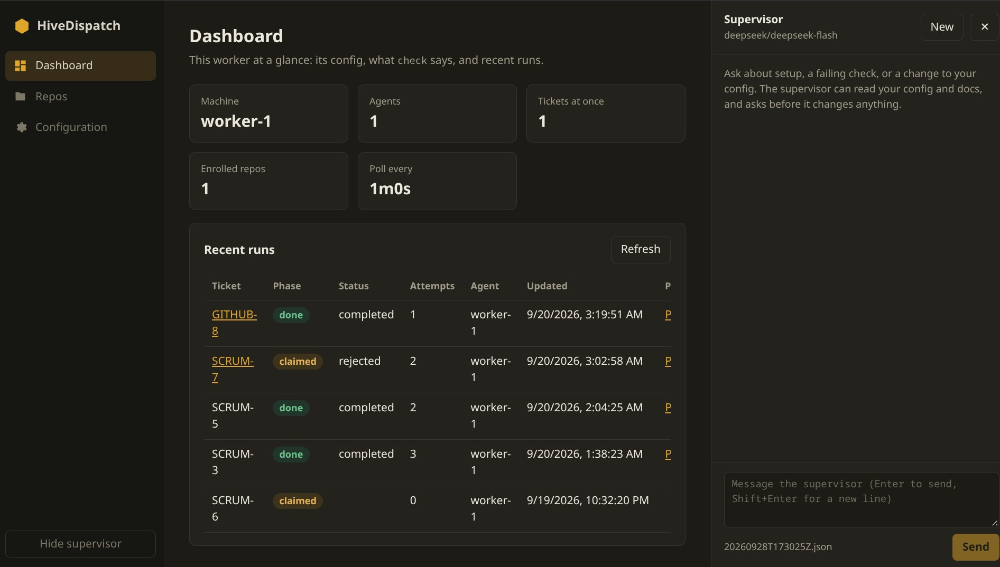
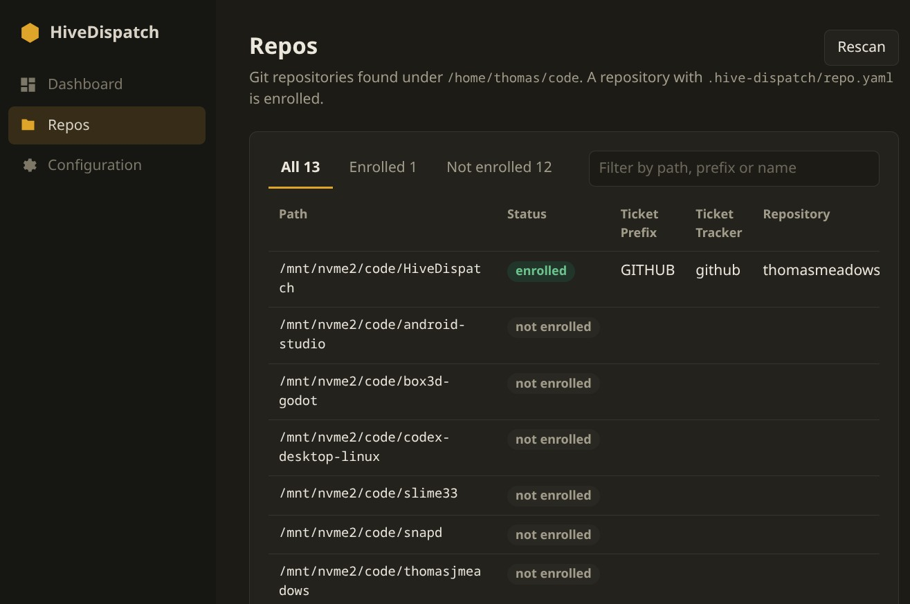
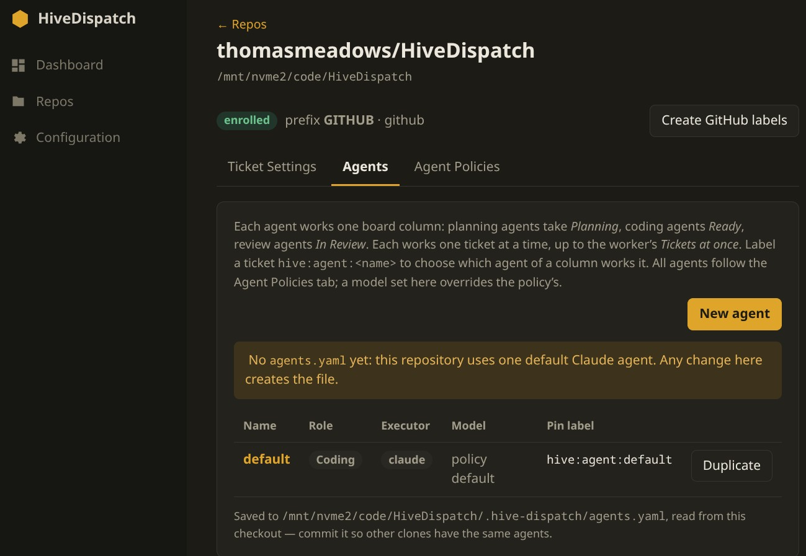

# HiveDispatch

Ticket-driven orchestration for autonomous coding agents.

HiveDispatch is a code orchestration agent that lets your tickets command coding agents. Instead of sitting in a terminal driving Claude Code or Codex yourself, you write a Jira ticket or a GitHub issue, and HiveDispatch takes it from there: it picks the ticket up, works it in an isolated branch, and opens a pull request. You talk to the agents through the ticket system you already use. When an agent needs to know something, it asks in a comment and waits. You answer in the thread, and it carries on. All of that works from a phone.

**The human in the loop sits at the end, at pull request review.** Nothing merges without you. If you want an agent to change something in the PR, say so in a comment and move the ticket back to Ready. The agent picks it up again, reads your feedback, and pushes a new round to the same branch. You stay in control of what ships. The agents do the typing.

**Several agents, several steps.** A repository can have planning agents that turn a rough ticket into a plan, coding agents that implement it, and review agents that check the PR before it reaches you. Each agent can use a different executor (Claude Code, Codex, Grok Build, Antigravity CLI, OpenClaw, or DeepSeek's DeepCode) and a different model. For example, one model writes the code and another reviews it, so one model's blind spots are caught by another before a human looks. Several agents can work on different tickets at the same time, each in its own worktree.

**Local or remote.** The worker is a single binary. Run it on your laptop next to your checkouts, or on a server or VM that stays up while you're away. Because all coordination goes through the tracker, where you run it doesn't change how you use it: you work with tickets either way. Several workers on different machines can share one board. Each one claims a ticket before touching it, so no ticket is worked twice, and each ticket shows which machine has it.

Under the hood it polls each repository's issue tracker (Jira Cloud or GitHub Issues, and one worker can serve both), triages each ticket, claims it, branches, runs a coding-agent CLI in an isolated git worktree, commits, opens a PR, and reports back on the ticket.

**v0.6.0 — alpha.** The single-worker MVP (v0.1.0) has run end to end on a real Jira project, GitHub repository, and Claude Code — including this repository's own tickets: a Jira ticket is triaged by Claude Code (dispatch / ask / reject), claimed, implemented by Claude Code in an isolated worktree, pushed, and opened as a GitHub PR — with questions posted back to the ticket and the run resumed when a human answers.

## How a ticket flows

1. **Poll** — the worker finds tickets in your Jira scope (e.g. `project = SCRUM AND labels = hive`) or GitHub issues by label, one board column at a time: **Planning**, **Ready** and **In Review**, each worked by that repository's planning, coding and review agents. Planning agents post a plan and move the ticket to Ready; review agents review the PR and pass it to a human or send it back. The steps below are the coding agent's.
2. **Claim** — it writes its agent id to the ticket and reads it back; two workers racing resolve to one winner.
3. **Triage** — Claude Code, read-only, inspects the repo and decides: dispatch with notes, ask one question, or reject.
4. **Branch** — a git worktree on `hive/<name>`, e.g. `hive/github-issues-12-create-website`, resumed if it already exists.
5. **Run** — one of the repository's agents (`.hive-dispatch/agents.yaml`: Claude Code or Codex, one ticket each) implements the ticket under the repo's `.hive-dispatch/policy.yaml`, with a step budget and a wall-clock timeout.
6. **Commit and push** — the agent commits as it goes; the worker safety-commits anything left and pushes.
7. **PR and report** — a pull request is opened (or found), and the ticket gets a comment and a status change. Every stop, including budget and timeout, leaves the ticket in a state a human understands.

## What it is not

- It never merges. Agents branch and open PRs; a human merges. Always.
- It does not replace the coding agent. Claude Code and Codex already ship memory, session resume, and context management; HiveDispatch wraps them.
- It is not a hosted service. Self-hosted on your laptop or your own server, no infrastructure beyond git and an agent CLI.

## Design

Read [`docs/design-spec.md`](docs/design-spec.md) for the architecture and [`docs/decisions.md`](docs/decisions.md) for every choice made along the way and the alternatives rejected. To build and test the project locally, see [`CONTRIBUTING.md`](CONTRIBUTING.md).

The control plane is deterministic. Model discretion is confined to two places: triage (is this ticket worth attempting, and how?) and code generation inside the executor. Everything between — polling, claiming, branching, reporting — is ordinary code with ordinary failure modes.

## Quick start

```sh
go install github.com/thomasmeadows/hivedispatch/cmd/hivedispatch@latest

hivedispatch init                 # writes ~/.config/hivedispatch/config.yaml, fully commented
hivedispatch supervisor           # or: chat with the built-in assistant, which edits the config and runs the checks for you
$EDITOR ~/.config/hivedispatch/config.yaml   # code_dirs: [~/code] (machine_id defaults to the hostname)

# Enrol each repository; each one picks its own tracker.
cd ~/code/yourrepo
hivedispatch init -github         # GitHub Issues: writes .hive-dispatch/repo.yaml + policy.yaml;
                                  # fill in, commit, run again to create the hive:* labels
export HIVE_JIRA_TOKEN=...        # Jira: https://id.atlassian.com/manage-profile/security/api-tokens
hivedispatch init -jira           # Jira instead: same two steps; the second creates the claim fields
hivedispatch scan                 # every git repository under code_dirs, and which are enrolled

# GitHub token for opening PRs: HIVE_GITHUB_TOKEN, or `gh auth login`, or your git
# credential helper — found automatically. Without one, branches are pushed and you
# open the PR yourself. (GitHub needs auth to open PRs even on public repos.)
hivedispatch check -live          # verifies each repository's tracker, reports the GitHub token source

hivedispatch run -once -executor fake -placeholder   # dry run: ticket → branch → PR, no agent
hivedispatch run                                     # the real thing
hivedispatch once jira-scrum-42                       # drive one ticket by hand (key or name)
hivedispatch status                                  # what has run, from the state branch
```

To use [Grok Build](https://github.com/xai-org/grok-build) for coding, install and authenticate its `grok` CLI, then set `executor: grok` on a coding agent in `.hive-dispatch/agents.yaml`. It also works as `code_with: grok` in a LangGraph workflow. See the [setup and permission settings](docs/config.md#grok-build--executor-grok).

[Antigravity CLI](https://antigravity.google/product/antigravity-cli) is also supported: install and authenticate `agy`, then set `executor: antigravity` on a coding agent (or `code_with: antigravity` in LangGraph). See [Antigravity setup and permissions](docs/config.md#antigravity-cli--executor-antigravity).

[OpenClaw](https://docs.openclaw.ai/cli/agent#agent-exec) is supported for coding through `executor: openclaw` or LangGraph’s `code_with: openclaw`. It requires `agent exec` support and configured OpenClaw providers. Runs use fresh sessions and a wall-clock timeout; step limits are unavailable. See [OpenClaw setup](docs/config.md#openclaw--executor-openclaw).

## The configuration website

Or do all of that in a browser: `hivedispatch website -open` serves a UI on `http://localhost:7878`. Every save shows a diff and whatever the loader still objects to, keeps a `.bak`, and preserves comments.

The **Dashboard** shows this worker at a glance: its machine name, how many agents and tickets it runs at once, the enrolled repositories, and recent runs with their pull requests. On the right is a chat with the supervisor, an assistant that has read these docs and can explain a failing check or edit the config for you. It asks for approval in the chat before it changes anything.



**Repos** lists every git repository `scan` finds under your code directories and shows which ones are enrolled. Enrol one from here.



Each repository has tabs for its ticket settings, its **Agents**, and its agent policies. Add planning, coding and review agents, choose Claude Code or Codex and a model for each, and pin a ticket to a specific agent with a `hive:agent:<name>` label.



**Agent Configuration** checks each coding-agent CLI (Claude Code, Codex, Grok Build, Antigravity, OpenClaw, DeepCode and the optional `hivegraph`) with `--version` and shows the version, its path, and which agents use it. A missing CLI has an **Install** button that runs its official installer on the worker after you confirm the command. Logging in to each CLI is still up to you.

The **Configuration** page edits the worker config, supervisor settings included.

By default the site listens only on loopback. On a remote worker, reach it through an SSH tunnel (`ssh -L 7878:localhost:7878 worker-host`) rather than binding `-addr` to a public interface: anyone who can reach the site can edit your config and install the agent CLIs.

### Running the website on hosted hardware

To reach the site on a VPS or another hosted machine without a tunnel, set a password and bind a public address:

```sh
export HIVE_WEBSITE_PASSWORD="$(openssl rand -base64 24)"   # keep a copy somewhere safe
hivedispatch website -addr 0.0.0.0:7878
```

The browser asks for it once; any user name works. Every request without it gets `401 Unauthorized`, and while it is set the site answers whatever host name it is reached by.

This is **one shared password for one person, and it is not suitable for multiple users**. There are no accounts, no roles, no logout and no record of who changed what. Anyone with the password can edit the config and drive the supervisor. Other things to know:

- **Put TLS in front.** Basic auth sends the password with every request, so over plain HTTP anyone on the path can read it. Run a reverse proxy such as Caddy or nginx with HTTPS, or keep using the SSH tunnel.
- **Use a long random password.** Failed attempts are not rate-limited or locked out.

## Graph workflows (optional)

An agent with `executor: langgraph` works a ticket through a [LangGraph](https://www.langchain.com/langgraph) workflow instead of a single CLI call:

1. A cheap chat model, such as DeepSeek, plans the change.
2. Claude Code or Codex codes it.
3. The repository's `checks` run, for example `go test ./...`, and the agent fixes until they pass.
4. The chat model reviews the diff against the plan, and the agent fixes what it finds.

The workflow is optional and needs Python only on workers that use it. Install the `hivegraph` that matches your `hivedispatch version`:

```sh
pipx install "git+https://github.com/thomasmeadows/HiveDispatch@v0.6.0#subdirectory=graph"
```

`hivedispatch check` prints this command for your version. With `code_with: langgraph`, the code step runs HiveDispatch's own coding agent on that model instead of Claude Code or Codex, with its shell limited to the commands the repository's policy allows. See [`docs/config.md`](docs/config.md) for `code_with`, `checks` and `graph:`.

## Tracing with LangSmith

HiveDispatch can send a trace of everything its agents do to [LangSmith](https://smith.langchain.com):

- **Supervisor turns:** every model call with its messages and token counts, and every tool call.
- **Tickets:** triage, each planning, coding or review run, and the coding CLI's own steps inside each run. Steps are the tool calls and commands Claude Code or Codex made, timed, with failures marked.

It is off by default. Turn it on with LangSmith's usual variables:

```sh
export LANGSMITH_TRACING=true
export LANGSMITH_API_KEY=lsv2_...
export LANGSMITH_PROJECT=hivedispatch     # optional; this is the default
```

`hivedispatch check` says where traces are going.

Traces carry prompts, ticket text, tool output and pieces of your code to LangSmith's servers, with each string cut to 64 KiB. To send only names, timings, statuses and token counts, set `LANGSMITH_HIDE_INPUTS=true` and `LANGSMITH_HIDE_OUTPUTS=true`.

Tracing never slows down or fails a run. If LangSmith is unreachable, traces are dropped and a warning is logged.

## Downloads and docs

Prebuilt binaries for Linux and macOS are on the [releases page](https://github.com/thomasmeadows/HiveDispatch/releases). Every step's prerequisites are in [`docs/setup.md`](docs/setup.md); every key in [`docs/config.md`](docs/config.md).

## License

Apache-2.0. See [LICENSE](LICENSE).
