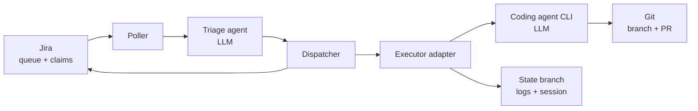
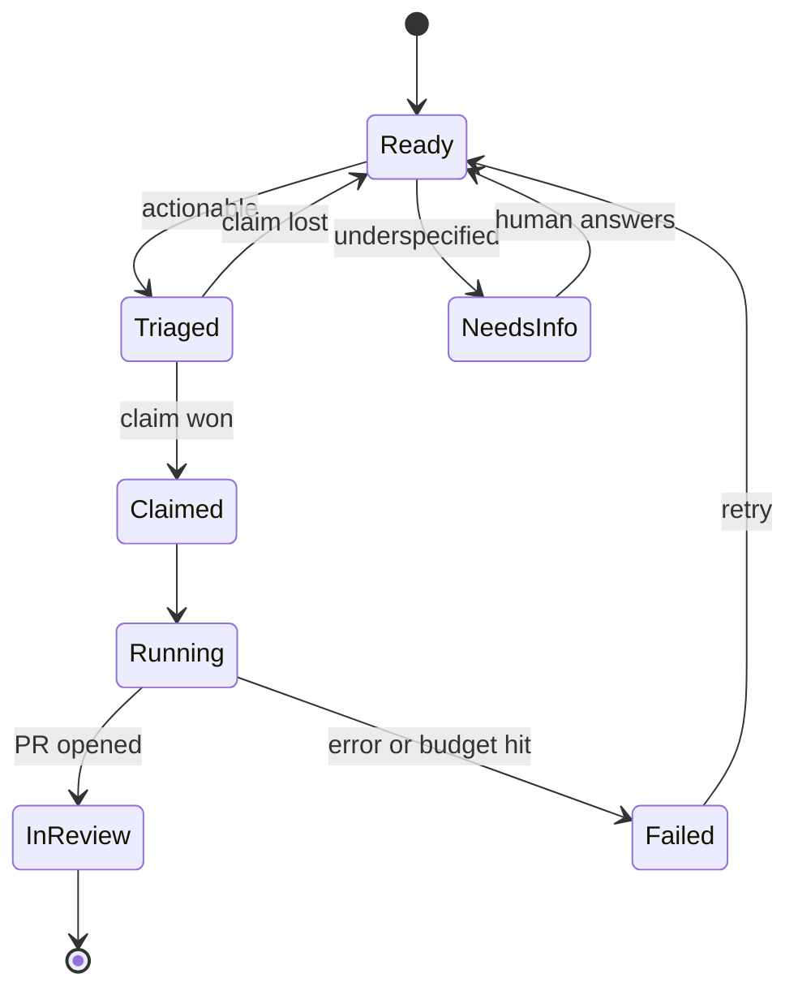
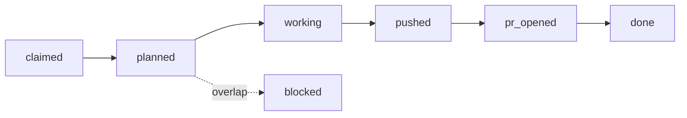

# HiveDispatch — Design Spec

Ticket-driven orchestration for autonomous coding agents.

2026-09-17 · Original design. Amendments are recorded in [decisions.md](decisions.md).

## Scope

HiveDispatch turns Jira tickets into pull requests by dispatching work to autonomous coding agents, so that starting and steering development work requires nothing but a ticket and a comment thread — including from a phone.

**v1 builds:** a single worker, end to end. Poll Jira → triage → claim → branch → run a coding agent → commit → open a PR → report back on the ticket.

**Designed, not built:** concurrent workers. The claim protocol, agent identity, and configuration model are specified here so that multi-worker operation is an implementation step rather than a redesign. Build this only once the single-worker loop is solid.

**Non-goals**

- Merging to master. Agents branch and open PRs; a human merges. Always.
- Replacing the coding agent. Claude Code and Codex ship memory, session resume, and context management. Wrapping them is the point.
- A hosted service. Self-hosted, runs from a laptop, no infrastructure beyond git and an agent CLI.

**The core architectural stance**

The control plane is deliberately deterministic. Model discretion is bounded to two places where it earns its unpredictability: triage, and code generation inside the executor. Everything between them — polling, claiming, branching, reporting — is ordinary code with ordinary failure modes.

**Language: Go, throughout.** The domain is concurrency — worker fleets, heartbeats, timeouts, subprocess supervision — which is what goroutines, channels and `context` cancellation are for. It also ships as a single static binary, which matters for a self-hosted tool people run on a laptop. No second runtime: the executor shells out to an agent CLI and the triage agent makes HTTP calls, neither of which needs Python's ML ecosystem.

**Prior art reviewed:** GitHub's Copilot coding agent for Jira (public preview, March 2026), yokai, Ticket Pilot, Agentic Coder. All are effectively single-worker. Concurrent claiming across multiple agents is the open problem and the reason this exists.

## Architecture

Five components. Only two of them call a model.



**Poller** — queries Jira on an interval for tickets matching the trigger JQL. Deterministic.

**Triage agent** — decides whether a ticket is actionable, which executor config fits, and on failure whether to retry, ask, or escalate. Agentic.

**Dispatcher** — claims the ticket, prepares a workspace, invokes the executor, writes results back to Jira. Deterministic.

**Executor adapter** — wraps one coding agent CLI behind a fixed interface. Deterministic wrapper around a non-deterministic process.

**State branch** — an orphan git branch holding per-ticket run state, logs, and opaque session tokens.

**Division of responsibility:** Jira owns the queue and the claims. Git owns history and run state. Neither does the other's job — that separation is what keeps claiming correct.

## Lifecycle and claiming



States live in Jira as status plus a small number of custom fields, so a human on a phone sees exactly what the system sees.

### The claim protocol

Jira owns claims, not git. This is the single most important decision in the spec.

The reason: if each worker writes only its own file on the state branch, commits never collide, so git's push rejection never fires and two workers can both take the same ticket cleanly. Partitioned writes defeat the very primitive you'd be relying on. Jira gives you one authoritative row per ticket instead.

1. Read the ticket. If `agent_id` is set and its heartbeat is fresh, skip it.
2. Write your `agent_id` and a claim timestamp.
3. Re-read the ticket. If `agent_id` is still yours, you won. If not, another worker beat you — back off and move on.
4. Heartbeat the timestamp periodically while running.

Optimistic concurrency with read-back verification. Two workers racing will both write, but only one survives the re-read, and the loser yields without having done any work.

**Stale claims.** A worker that dies mid-run leaves a claim behind. Any worker seeing a claim older than the heartbeat timeout may reclaim it. Set the timeout well above the longest expected run — a reclaim during a live run means duplicate work.

**Idempotency.** The branch name derives from the ticket key (`hive/PROJ-42`). A reclaimed or restarted run targets the same branch and the same PR, so a crash-restart resumes rather than duplicates.

**Known limitation to state in the README:** Jira field writes are not transactional, so the read-back window is small but real. With a poll jitter per worker and a short backoff on a lost claim, collisions are rare and harmless. A strict guarantee would need a real lock, which is infrastructure this project deliberately doesn't have.

## Run phases and overlap detection

A run records its phase in the state file, written and pushed *before* each next action starts. The phase plus a stale heartbeat says exactly where a run stopped, with no inference required.



### Plan before work

`planned` always precedes `working`. The plan phase runs the executor in a read-only planning mode and returns a declared file footprint — the files the run expects to touch — without writing anything.

That footprint is what makes overlap detection possible. Comparing ticket descriptions is guesswork; comparing declared file lists is not.

Between `planned` and `working`:

1. Read the footprints of all in-flight runs from the state branch.
2. On no overlap, register this run's footprint and proceed to `working`.
3. On overlap, move the ticket to blocked with a reference to the ticket holding those files, release the claim, and requeue when that ticket reaches `done`.

File footprints are therefore a second, finer-grained claim layered under the Jira ticket claim: Jira answers who owns the ticket, the state branch answers who owns the files.

### Footprint drift

A plan is a prediction. A run may touch files it didn't declare.

On drift, the executor re-checks the new files against registered footprints. If they're free, extend the registration and continue. If they collide with another in-flight run, stop — commit what exists, comment the collision on the ticket, and release. Proceeding into a known conflict to save a run is how you get a merge no one can untangle.

### Stop cause

Every terminal phase records why it stopped: `budget`, `timeout`, `step_budget`, `overlap`, `error`, `killed`. A rate-limit response is distinguishable from a crash, which is the whole difference between a stall that looks alarming and one that's merely boring.

**The orchestrator posts the recovery comment, never the executor** — the executor may be the thing that just died. The comment is a template filled from phase, cause, and artifacts:

> Stopped at 14:02 — provider rate limit reached. Completed 3 of an estimated 5 files. Work committed to `hive/PROJ-42`. Quota resets 04:30 UTC; will resume automatically. No PR opened.

### Completion is declared, not inferred

A run is complete only when the executor returns a terminal status and the phase reaches `done`. Absence of a PR does not mean failure — a run that correctly concluded no change was needed also has no PR.

Artifacts corroborate rather than decide. Uncommitted changes confirm it died during `working`; a pushed branch with no PR confirms it died between `pushed` and `pr_opened`. If the phase says `done` but artifacts disagree, that's a bug: escalate to a human rather than guessing.

**Planning costs tokens.** The pre-flight budget check covers the plan phase and the work phase together, so a run is never started that can afford to plan but not to build.

## Executor contract

Coding agents will diverge — on memory, on session resume, on how they report progress. An orchestrator that couples to one provider's semantics gets rewritten every time that provider ships. The fix is a contract at the boundary.

```go
type Executor interface {
    Name() string
    Plan(ctx context.Context, t Task) (Footprint, error)
    Run(ctx context.Context, t Task) (Result, error)
}

type Task struct {
    TicketKey   string
    Prompt      string   // ticket body + comment thread, rendered
    Workspace   string   // path to the prepared worktree
    ResumeToken string   // opaque; stored, never interpreted
    StepBudget  int
}

type Footprint struct {
    Files []string       // declared, checked against in-flight claims
}

type Result struct {
    Status       Status   // Completed | NeedsInput | Failed
    StopCause    Cause    // Budget | Timeout | StepBudget | Overlap | Error | Killed
    Summary      string   // posted to the ticket
    Question     string   // when NeedsInput
    ResumeToken  string   // opaque; persisted for the next run
    ChangedFiles []string
    Log          string
}
```

Timeouts ride on the `context`, not a field — cancellation propagates to the agent subprocess for free.

**The key rule: `resumeToken` is opaque.** The orchestrator stores it and hands it back on the next run. It never parses it, never reasons about it, never depends on its shape. Whatever a provider puts in there — a session id, a serialized context, a file path — is that adapter's business.

That single decision is what turns provider divergence from a rewrite into an adapter change.

**Adapters for v1:** Claude Code first. Add a second (Codex) only once the first works end to end — a second implementation is what proves the abstraction.

**What the orchestrator guarantees to the adapter:** a clean worktree, a rendered prompt, and bounded resources. **What the adapter guarantees back:** a terminal status and a human-readable summary, always — even on failure. No adapter is allowed to return nothing.

## Triage agent

The one genuinely agentic component you write yourself. It matters because it's the difference between a system that attempts every ticket and one that knows which tickets are worth attempting.

**Input:** ticket summary, description, comment thread, repo metadata, available executor configs.

**Tools available to it:**

- `read_repo_tree(path)` — is the area this ticket describes even in this repo?
- `search_code(query)` — does the thing being changed exist?
- `read_ticket_history(key)` — has this been attempted before, and how did it fail?

**Decisions it returns:**

| Decision | Meaning |
| --- | --- |
| `dispatch` | Actionable. Names the executor config and a rendered prompt. |
| `needs_info` | Underspecified. Returns the question to post as a comment. |
| `reject` | Out of scope for automation — architectural, cross-cutting, or too large. |

It's an agent by the strict definition: the model chooses which tools to call and when it has enough to decide, rather than running a fixed sequence. That's also why it gets a step budget.

**Why this earns its place rather than being decorative:** the failure mode of these systems isn't bad code, it's confidently attempting tickets that were never well-specified, then burning tokens and leaving a confusing PR. Triage is the cheap filter in front of the expensive call.

**Guardrail:** triage can only decide, never act. It can't write to the repo, can't claim, can't comment. It returns a decision and the dispatcher does the rest. Keeping the agentic component read-only bounds the blast radius of a bad decision to a wasted poll cycle.

## Supervisor tier

**Build this last, and only after the rules-based version has demonstrably failed.** Placed here in the spec because it completes the architecture, not because it comes next.

Triage decides about one ticket. The supervisor decides about the fleet. It runs on a slower cadence than the poller, reads the state branch, and answers questions that rules get wrong often enough to matter:

- A ticket has failed twice. Retry, rewrite the prompt, split it, or escalate to a human?
- Two ready tickets touch overlapping files. Serialize them, or run both and accept a merge conflict?
- A worker has run 40 minutes on something triaged as small. Kill it or let it finish?
- Three tickets are ready and one worker is free. Which one goes first?

Each of these has a rules-based answer that is wrong maybe a fifth of the time. That ratio is the signal: the decision space is too large to enumerate, which is precisely where model discretion earns its cost.

**Same guardrail as triage: it proposes, the dispatcher executes.** The supervisor has read access to fleet state and no write access to repos, tickets, or claims. A bad supervisor decision wastes a cycle; it cannot corrupt anything.

### Where agency lives

| Layer | Decides | Nature |
| --- | --- | --- |
| Supervisor | How the fleet allocates and recovers | Agentic (yours) |
| Triage | Whether and how to attempt a ticket | Agentic (yours) |
| Dispatcher | Nothing — executes decisions | Deterministic |
| Executor | How to write the code | Agentic (provider's) |

The principle: **agency is placed where the decision space is too large to enumerate, and withheld everywhere else.**

### Why it comes last

Building the supervisor before the deterministic version has run means a model making decisions you can't evaluate, because there's no baseline to compare against. Run the rules-based fleet first. Log every point where the rule chose badly. Build the supervisor against those real examples, and use them as its evals.

## State in git

Run state lives on an orphan branch, `hive/state`. No database, no infrastructure, and the audit trail is free.

```
hive/state
  runs/
    PROJ-42.json        # one file per ticket, owned by its claiming worker
    PROJ-51.json
  logs/
    PROJ-42/
      2026-09-17T14-02-11.log
  agents/
    worker-a.json       # identity, config, last heartbeat
```

**Per-ticket run file:**

```json
{
  "ticket": "PROJ-42",
  "agent": "worker-a",
  "branch": "hive/PROJ-42",
  "attempts": 2,
  "resumeToken": "<opaque>",
  "lastStatus": "needs_input",
  "prUrl": "https://github.com/..."
}
```

**One file per ticket, written only by the worker holding the claim.** This makes concurrent writes collision-free by construction — which is correct here, because claiming already happened in Jira. Git is the log, not the lock.

**Push conflicts.** A non-fast-forward rejection means someone else pushed. Pull with rebase, confirm the incoming changes don't touch your file, push again. If they do touch your file, something violated the claim invariant — fail loudly rather than merging, because that's a bug, not a race to smooth over.

**Tradeoffs to state in the README:**

- Not queryable. "What's in flight?" means reading every file. Fine at tens of tickets, bad at thousands.
- Grows without bound. Needs a retention policy — squash or prune logs older than N days — or clones get slow.
- No cross-file atomicity. Mitigated by keeping each ticket's state in exactly one file.

The trade being made: no database and a free audit log, paid for in queryability and growth. Name it as a deliberate choice.

## Failure handling and blast radius

The failure mode that makes a system like this unusable isn't bad code — it's a ticket sitting in limbo with no explanation. Every terminal path must leave the ticket in a state a human understands.

| Failure | Response |
| --- | --- |
| Triage rejects | Comment why, move to a human-review status, release claim |
| Executor times out | Comment with partial log, release claim, increment attempts |
| Step budget exhausted | Same, plus flag as likely underspecified |
| Tests fail after N retries | Open the PR as draft with failures documented |
| Push rejected repeatedly | Fail loudly — claim invariant may be broken |
| Worker crashes | Claim goes stale, another worker reclaims after timeout |
| Jira unreachable | Back off and retry; never proceed on an unconfirmed claim |
| Budget exhausted mid-run | Commit WIP, no PR, comment with phase and reset time, release claim, keep resume token |
| Footprint collision after planning | Block the ticket against the one holding those files, release claim, requeue on its completion |
| Phase says done, artifacts disagree | Treat as a bug — escalate to a human, never guess the outcome |

Every row above is driven by the recorded phase and stop cause rather than by inspecting artifacts — see Run phases and overlap detection. Artifacts corroborate; the phase decides.

**Bounds on every run:** step budget, wall-clock timeout, and a maximum attempt count per ticket. After the cap, stop and ask a human — a ticket that has failed three times will not succeed on the fourth.

**Blast radius**

- Agents never touch master. Branch and PR only, always.
- Agents never merge. A human reviews every change.
- The worktree is ephemeral and scoped to one ticket.
- Repo write scope is limited by the token the worker runs with — give it push rights to branches and PR creation, nothing else.
- Triage is read-only.

**Observability.** Structured log lines per run, written to the state branch: ticket, agent, decision, duration, outcome. Enough to answer "what did the swarm do last night" from a phone. This is deliberately more than a dashboard you have to remember to check — the run log is the artifact, and the ticket comment is the notification.

**The human-in-the-loop path.** When the executor returns `needs_input`, the question is posted as a ticket comment and the claim is released. The ticket is now a suspended state machine — no separate store, no session to keep alive. A human answers in the thread, the ticket returns to the trigger status, and the next poll resumes with the stored resume token. That's the piece that makes phone-driven development work.

## Budget and scheduling

Most users will run this on a consumer subscription or pay-as-you-go API credit, not an enterprise plan. Both the cost model and the failure mode change accordingly, and neither is optional to handle.

### The partial-completion problem

A run that stops because quota ran out is worse than a run that never started: a branch with half an implementation, a ticket claimed and silently abandoned, and a human who has to work out what state things are in.

**The fix is not prediction — it's making every stop point safe.**

- **Commit incrementally.** The executor commits as it goes, so an interrupted run leaves a coherent WIP branch rather than a dirty worktree.
- **Never open a PR from an incomplete run.** On abort, the branch stays, the PR does not — or opens as a draft explicitly titled as incomplete, with the log attached.
- **Always release the claim.** An aborted run must comment what happened, how far it got, and what remains, then release. A ticket must never be left claimed by a dead run.
- **Record the resume token.** An interrupted run that can resume later is a pause, not a failure.

That ordering matters: safe abort is a correctness requirement, and budget prediction is only an optimisation on top of it.

### Pre-flight budget check

Before dispatch, estimate whether the run can plausibly finish, using the triage complexity signal and rolling averages of recent runs of similar size. If the remaining budget is below the estimate plus a margin, don't start — comment on the ticket saying it was deferred for budget, and leave it queued.

**The honest limitation:** on subscription plans there is usually no API to query remaining quota. The orchestrator can only track its own consumption locally and infer the rest, so treat every estimate as advisory and every rate-limit response from the provider as the real signal. Document this plainly — a budget feature that silently guesses wrong is worse than one that admits it's approximate.

**Config surface:** a per-run token ceiling, a daily fleet ceiling, and a margin percentage. Warn at a threshold, stop at the ceiling.

### Scheduling windows

Agents competing with you for the same quota during your working hours is a real problem on consumer plans — the fleet eats the budget you wanted for interactive work.

So: configurable run windows. Outside the window the poller idles and claims nothing. A run already in flight when the window closes finishes rather than aborting mid-ticket, since a safe stop beats a punctual one.

This also fits the overnight use case the project is built around: file tickets from a phone during the day, let the fleet work while you sleep, review PRs in the morning.

**Config surface:** window definitions with a timezone, plus a drain-vs-abort choice for runs crossing the boundary, and an override for urgent tickets carrying a priority label.

## Build order

Build the coordination before the expensive, slow, non-deterministic part. Debugging a claim race while waiting on real agent runs is miserable.

1. **Jira client.** Against the current endpoints — see the gotcha below. Read a ticket, write a field, post a comment. Nothing else.
2. **Poll and claim, with a fake executor** that just comments "would have worked on this." Run two workers against one ticket and watch the claim protocol hold.
3. **Git plumbing.** Worktree, branch, commit, push, open a PR. Still fake executor.
4. **Real executor adapter.** Claude Code. Now the slow part exists, but everything around it is known-good.
5. **Triage agent.** Add the decision layer in front of dispatch.
6. **Second adapter.** Codex. This is what proves the interface.
7. **Concurrency.** Multiple workers, distinct configs, parallel branches.

### Jira API gotcha

`/rest/api/3/search` has been fully removed and returns 410. Use `/rest/api/3/search/jql`. Two behavior changes come with it: pagination uses `nextPageToken` rather than `startAt`, and `fields` now defaults to `id` only where the old endpoint returned `*navigable` — so pass `fields` explicitly or you'll get issues with no summary or description and blame your JQL. Many client libraries still haven't migrated; consider calling REST directly.

### Keep a decisions log

Every design choice and the alternative rejected, every failure hit and how it was diagnosed, every place the abstraction leaked — all go in `docs/decisions.md`. The races, the stuck tickets, the duplicated PRs are the material contributors need to reason about the system. A repo plus a decisions log is something people can build on; a clean repo with no scars is not.

## Direction

The end state is a system that takes a backlog and returns reviewed pull requests, with humans approving merges and answering questions. Not an autonomous team — a pipeline with humans at the decision points that matter.

**Capabilities, not roles.** The temptation is to model this on a human org chart: a QA agent, a scrum agent, a manager agent. That imports ceremony built for human constraints — limited context, communication overhead, career incentives, accountability chains — that agents don't share. The roadmap below is organised by what the system needs to do, and each capability is justified on its own terms rather than by analogy to a job title.

**The through-line: AI needs less guidance than verification.** Every capability added should be paired with a way to check whether it did the right thing. Adding judgment without adding verification just moves the failure somewhere harder to see.

### Decomposition

Oversized tickets are the most common cause of agent failure — not bad code, wrong scope. A planning pass that splits a large ticket into small ones, each independently shippable, is the highest-leverage addition after triage.

Verification: did each child ticket produce a PR that merged without rework? If children fail at the same rate as the parent would have, the decomposition isn't earning its cost.

### Dependency detection

**Promote to the v2 spec, not the roadmap.** Concurrent workers touching overlapping files is a correctness problem, not a refinement. Before dispatch, compare a ticket's likely file footprint against in-flight claims; on overlap, move the ticket to blocked with a reference to the ticket blocking it, and release it when that one lands.

This is the concrete form of the "two agents, one codebase" problem that none of the prior-art projects solve, and it's what makes the swarm real rather than parallel-and-hopeful.

### Review

A second model reviewing the first's diff is cheap, runs in seconds, and catches a real class of problems — especially the ones the author model is blind to because it wrote them. Distinct from tests, which belong inside the executor as part of doing the work rather than as a separate actor.

### Complexity assessment

A quick scored estimate posted to the ticket before work starts. Optional, off by default.

Honest about what this is: pointing is a ritual that signals deliberation. A score on the ticket makes the work legible to humans who expect estimates to exist, and it gives the supervisor a cheap signal for ordering and for catching runs that have exceeded their estimate. It is not a scheduling input the system depends on.

### Bidding

Multiple agents scoring a ticket and competing for it. Worth building only once agents are genuinely heterogeneous — different models, different context, different cost profiles. Identical agents bidding produce N nearly identical numbers at N times the cost.

The question bidding actually answers is a budget question: which model is best, which is best per token, which is cheapest that still succeeds. That makes it a procurement mechanism rather than a coordination one, and it only pays once there's a real spread between the options.

### Production feedback loop

An agent watching live logs for outlier errors, classifying each as a genuine defect, an attack attempt needing hardening, or a control working as designed — and filing tickets for the first two.

**This is the strongest idea in the roadmap and it stands alone.** It closes the loop from production back to the backlog with no human in the middle, and unlike everything else here it doesn't depend on the rest of the system existing. Viable as its own project.

Verification is the hard part: a classifier that files noise trains people to ignore the queue. Precision matters far more than recall.

### Fleet operations

Cost, throughput, and accuracy over time. What the fleet spent, what landed, what got reverted, which configs succeed and which burn tokens. Operations, not ceremony.

### Reporting

Daily through yearly rundowns with actionable items and outliers. Mostly a query over the state branch rather than an agent — and the place where "what did the swarm do while I was asleep" gets answered from a phone.

### Configuration

Everything above is opt-in, and configuration lives in the repo it governs — versioned, reviewable, diffable, with changes going through the same PR process as code.

That matters more as capabilities accumulate. Which model runs which stage, what's enabled, what the budgets and thresholds are — these are decisions teams will want to change deliberately and trace afterward. A config file in the repo makes every one of them a reviewable change rather than a setting someone adjusted in a UI at 2am.
