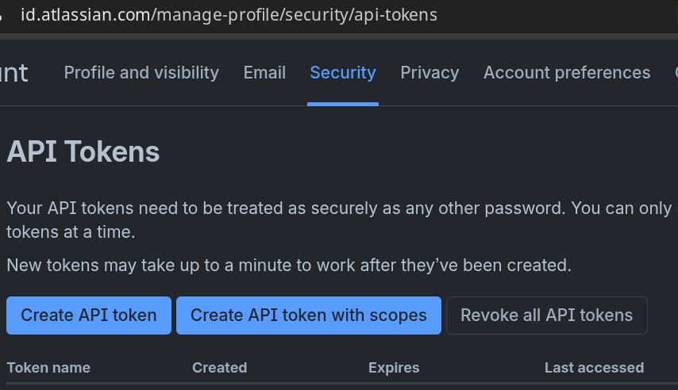
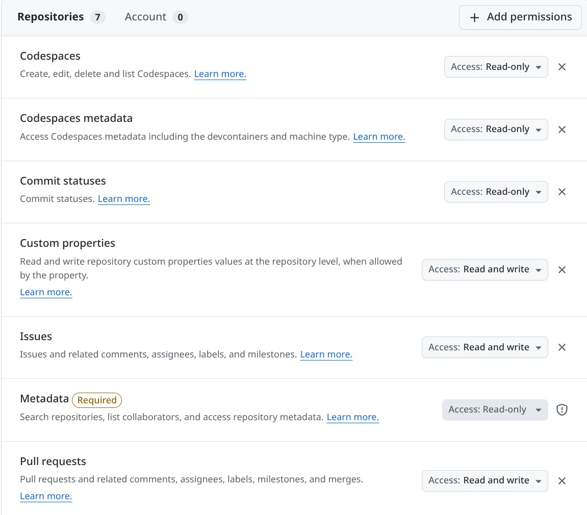
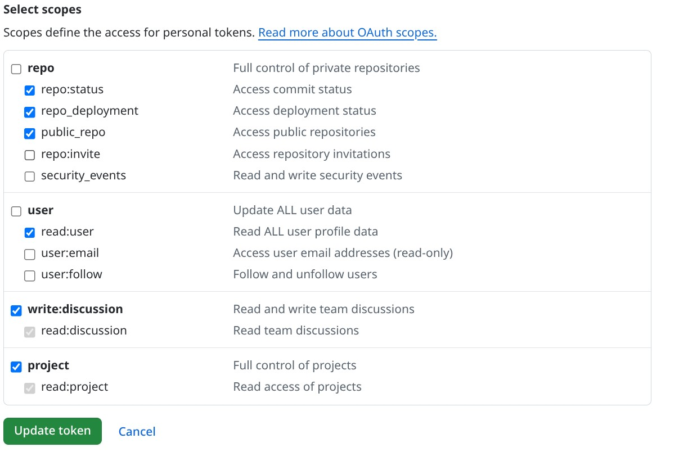

# Setup

HiveDispatch needs: an issue tracker per repository — its GitHub Issues, or a Jira Cloud site (API token, two custom fields for the claim protocol, five workflow statuses) — a GitHub token for opening pull requests, git credentials that can clone and push the repositories it works in, and a logged-in Claude Code CLI (or Codex CLI, for agents with `executor: codex`).

## 0. Start here

Configuration has two layers ([`docs/config.md`](config.md) has every key): a **worker config** for this machine, and a **`.hive-dispatch/` folder in each repository** that says which tracker holds that repository's queue. Repositories can use different trackers.

```sh
hivedispatch init
```

writes a commented starter worker config to `~/.config/hivedispatch/config.yaml` (or `-config PATH`) and never overwrites a non-empty file. Point `code_dirs` at the folder your checkouts live in (`machine_id`, which names this machine on tickets, defaults to the hostname):

```yaml
machine_id: laptop-1
code_dirs: [~/code]
```

Then enrol each repository the worker should take tickets for:

```sh
cd ~/code/yourrepo
hivedispatch init -github      # queue in this repository's GitHub Issues (section 8)
# or
hivedispatch init -jira        # queue in a Jira project (sections 1–4)
```

The first run writes `.hive-dispatch/repo.yaml` (the tracker settings, every field commented) and `.hive-dispatch/policy.yaml` (the agent policy, section 9). Fill in `repo.yaml`, commit both, and run the same command again: it creates the labels or claim fields that tracker needs. `name`, `url` and `default_branch` come from the `origin` remote.

Any repository under a code dir with a `repo.yaml` is enrolled; there is nothing else to register. Repositories elsewhere go under `repos:` by path. See what the worker would pick up with

```sh
hivedispatch scan              # every git repository under code_dirs, and which are enrolled
hivedispatch check             # validates the worker config and every enrolled repository
```

If a command reports `invalid config`, each line names the file and field and where to get the value.

## 0b. Or let the supervisor walk you through it

```sh
export ANTHROPIC_API_KEY=...     # or OPENAI_API_KEY, DEEPSEEK_API_KEY, HF_TOKEN, or a running Ollama
hivedispatch supervisor
```

opens a chat with an assistant built into the binary. It has read these docs, sees the current `hivedispatch check` output, and can write the config for you (you approve every diff), run `check -live` and `scan` on its own, read each enrolled repository's `.hive-dispatch/` files, and run `init -jira` / `init -github` (in the repository it was started from) / a fake-executor dry run (you approve each of those), and remembers what it learned in `~/.config/hivedispatch/supervisor/memory.md` for next time. It never runs the real executor. `echo "why does check fail?" | hivedispatch supervisor` asks one question and exits. Which model answers is in [`docs/config.md` — Supervisor config](config.md#supervisor-config--confighivedispatchsupervisorconfigyaml).

## 1. API token

Create one at https://id.atlassian.com/manage-profile/security/api-tokens with **Create API token** — not *Create API token with scopes*: scoped tokens only work through the `api.atlassian.com` gateway, and HiveDispatch talks to your site's `base_url` directly.



Export it:

```sh
export HIVE_JIRA_TOKEN=...
```

Put `email` (the Atlassian account the token belongs to) in the worker config under `jira:`, and `base_url` in the repository's `.hive-dispatch/repo.yaml`. The token never goes in YAML. One token and email serve every Jira repository on the worker.

## 2. Claim fields

When a worker takes a ticket it has to tell every other worker — and every human looking at the board — that the ticket is taken and that the worker is still alive. HiveDispatch does that with two custom fields on the issue:

| Field in Jira | `repo.yaml` key | Meaning |
|---|---|---|
| **HiveDispatch Agent** | `jira.fields.agent_id` | the `agent_id` of the worker that holds the ticket; empty when unclaimed |
| **HiveDispatch Claimed At** | `jira.fields.claimed_at` | when that worker last checked in (its heartbeat, refreshed every `heartbeat_interval`). A claim older than `claim_timeout` is treated as abandoned — the worker probably crashed — and another worker may take the ticket over |

Two workers racing for one ticket both write the Agent field and then read it back; only the one whose name survives the read-back proceeds. That is the whole coordination mechanism, and it is why these are Jira fields rather than something in git.

Create them with:

```sh
hivedispatch init -jira        # in the repository, once repo.yaml is filled in
```

which adds both fields (if missing) and puts them on the default screen so they are writable. You do **not** need to copy anything into the config: the worker looks the fields up by name at startup. Set `jira.fields.agent_id` / `claimed_at` to explicit `customfield_NNNNN` ids only if you renamed the fields or run against several sites.

**Manual alternative:** Settings → Issues → Custom fields → Create a *Text field (single line)* named `HiveDispatch Agent` and a *Date time picker* named `HiveDispatch Claimed At`. Then add both to the edit screen of every project HiveDispatch works in. If a claim fails with "Field cannot be set. It is not on the appropriate screen", this step was missed.

**Team-managed projects** (Jira calls them "next-gen"; `hivedispatch check -jira` labels them) keep their own field list per issue type, and there is no API to attach a global field to them. After `init -jira`, open the project → **Project settings → Issue types**, pick each issue type HiveDispatch should handle (Task, Story, …), and in the *Fields* panel search for "HiveDispatch" and add both **HiveDispatch Agent** and **HiveDispatch Claimed At**. `check -jira` verifies the fields are editable on a real issue and tells you if this step is still missing.

**Duplicate fields.** If `check -jira` warns that several fields share a claim-field name, an earlier version created duplicates; the worker uses the lowest id. Delete the others under Settings → Issues → Custom fields (they go to the trash and can be restored).

## 3. Workflow statuses

Planning · Ready · In Progress · Needs Info · In Review · Needs Human

Any names work; map them under `jira.statuses`. Planning is needed only when a repository has a planning agent. The workflow must allow transitions between them from every state HiveDispatch uses (Planning → Ready/Needs Info, Ready → In Progress, In Progress → Needs Info/In Review/Needs Human/Ready, In Review → Ready/Needs Human, Needs Info → Ready or Planning). The simplest workflow allows all transitions.

## 4. Ticket prefix

Jira tickets keep their own keys inside HiveDispatch's: `SCRUM-4` becomes `JIRA-SCRUM-4`, named `jira-scrum-4-create-website`, where `JIRA` is `ticket_prefix` in `repo.yaml` (default: `JIRA`). Which Jira projects a repository takes tickets from is up to `jira.jql`.

## 4b. Scope query

`jira.jql` in `repo.yaml` selects which tickets are HiveDispatch's, without a status, e.g.

```
project = HIVE AND labels = hive
```

Each column's agents add its status from `jira.statuses`: planning agents look at `status = "Planning"`, coding agents at `status = "Ready"`, review agents at `status = "In Review"`. Using a label means a human explicitly opts each ticket in; moving it to a column says what should happen next.

## Example configuration

`~/.config/hivedispatch/config.yaml`:

```yaml
machine_id: worker-a
code_dirs: [~/code]
repos:
  - path: ~/work/other-repo     # outside code_dirs
jira:
  email: you@example.com        # only needed when a repository uses Jira
```

`~/code/yourrepo/.hive-dispatch/repo.yaml`, a Jira repository:

```yaml
ticket_tracker: jira             # ticket_prefix defaults to JIRA
jira:
  base_url: https://yoursite.atlassian.net
  jql: 'project = HIVE AND labels = hive'
```

`~/work/other-repo/.hive-dispatch/repo.yaml`, a GitHub Issues repository on the same worker:

```yaml
ticket_tracker: github
ticket_prefix: OTHER             # the default, GITHUB, would clash if another repository used it
```

## 5. GitHub

Two separate things talk to GitHub, with two separate credentials:

| Purpose | Credential | Needed when |
|---|---|---|
| Clone and push branches | your own git credentials — an ssh key or a credential helper | always; `git clone <url>` must work non-interactively as the worker's user |
| Open pull requests via the API | a GitHub token | to open PRs — **even on public repositories**, GitHub does not accept anonymous PR creation. Without one the worker still pushes the branch and asks on the ticket for a human to open the PR |

The token is found automatically, in this order:

1. `HIVE_GITHUB_TOKEN` in the environment
2. `gh auth token` — if you use the GitHub CLI and have run `gh auth login`, nothing else is needed
3. your git credential helper for `github.com` (`git credential fill`) — if you push over HTTPS with a stored token, that token is reused

`hivedispatch check` prints which source it found.

### Which kind of token

GitHub has two kinds of personal access token. HiveDispatch does not care which you use — both are sent the same way (`Authorization: Bearer …`), only the prefix differs (`ghp_` classic, `github_pat_` fine-grained, `gho_` for the GitHub CLI's token), and nothing in HiveDispatch inspects it. What differs is what each kind can be allowed to do:

| Need | Fine-grained token | Classic token |
|---|---|---|
| Open pull requests | *Pull requests: Read and write* + *Contents: Read* | `repo` (or `public_repo` for public repos only) |
| Read and write issues (repositories with `tracker: github`) | *Issues: Read and write* | `repo` |
| Move cards on an **organisation-owned** Projects board | *Projects: Read and write* on the organisation | `project` |
| Move cards on a **user-owned** Projects board | **not possible** — fine-grained tokens have no account-level Projects permission | `project` |

Recommendation: a fine-grained token scoped to the repositories HiveDispatch works in, unless you mirror state to a board under your personal account — then one classic token with `repo` + `project` does everything. (`gh auth login` followed by `gh auth refresh -s project` yields such a token, and the worker picks it up automatically when `HIVE_GITHUB_TOKEN` is unset.)

To create a fine-grained token: https://github.com/settings/personal-access-tokens → *Generate new token*, choose the repositories, and grant the permissions from the table. For GitHub Issues without a Projects board, that is *Issues* and *Pull requests* at *Read and write* (*Metadata: Read-only* is added automatically):



For a classic token: https://github.com/settings/tokens → *Generate new token (classic)* and tick the scopes. For a board under your personal account, tick `project` alongside the repository scope — `public_repo` as here if every repository is public, otherwise the whole `repo` box:



Then:

```sh
export HIVE_GITHUB_TOKEN=...
```

If you use GitHub Enterprise, set `github.api_url` in the worker config (default `https://api.github.com`).

## 6. Work directory layout

```
<workroot>/repos/<owner>__<repo>/repo      base clone (no checkout)
<workroot>/repos/<owner>__<repo>/<KEY>     worktree for one ticket, branch hive/<name>
<workroot>/repos/<owner>__<repo>/.state    worktree of the hive/state branch
```

Every ticket gets its own worktree, branched from `origin/<default branch>` in the worker's own clone — never from your checkout, whose branch and working tree the worker does not touch. With `max_concurrent: N` in the worker config, up to N tickets are worked in parallel, one worktree each; git operations on the shared clone are serialised per repository.

Set `state_store: local` to keep run state in `<workroot>/state/` instead of the `hive/state` branch (useful for trials; not shared between workers).

## 7. Security

The worker runs with your git credentials and can push any branch your credentials allow. Scope the deploy key or token to branch creation and PR opening where your host supports it, never to the default branch, and run the worker under a dedicated account when you can.

## Verify

```sh
hivedispatch check -jira
hivedispatch run -once -placeholder   # takes one Ready ticket to a PR with a placeholder commit
```

## 8. GitHub Issues instead of Jira

A repository whose `repo.yaml` says `tracker: github` needs none of sections 1–4. The GitHub token (section 5) then also needs **Issues: read and write**. State lives in labels and the claim in a hidden marker in the issue body, so nothing else has to exist in the repository.

```sh
cd ~/code/yourrepo
hivedispatch init -github     # first run: writes .hive-dispatch/; set project, commit, then:
hivedispatch init -github     # creates hive:ready, hive:in-progress, hive:needs-info, hive:in-review, hive:needs-human
hivedispatch check -live
```

To queue an issue, add the **`hive:ready`** label (one tap in the GitHub mobile app). The worker swaps the label as the ticket moves: `hive:in-progress` while it works, `hive:needs-info` when it has a question — answer in the thread and put `hive:ready` back — `hive:in-review` when a pull request is open, `hive:needs-human` when it will not attempt the issue. Ticket keys are `<ticket_prefix>-ISSUES-<issue number>` (`-PROJECT<N>-` when `github.project.number` is set), so issue #12 titled "Create website" is `GITHUB-ISSUES-12` and its branch is `hive/github-issues-12-create-website`.

Label names are configurable under `github.labels` in `repo.yaml`.

### A GitHub Projects board

Optionally the worker also moves each issue's card on a GitHub Projects (v2) board as the label changes, so the board shows the same state as the labels. Point `github.project` in `repo.yaml` at the board — `owner` and `number` come from its URL, `github.com/users/OWNER/projects/N` or `github.com/orgs/OWNER/projects/N` — and name the option of its single-select field (`Status` by default) for each state:

```yaml
github:
  project:
    owner: thomasmeadows
    number: 2
    field: Status
    columns:
      ready: Ready
      in_progress: In Progress
      needs_info: Needs Info
      in_review: In Review
      needs_human: Needs Human
```

Every option must already exist on the board; `hivedispatch check -live` lists the ones that do not. Projects has no REST API, so the token additionally needs project access, and **which token works depends on who owns the board**:

| Board | Token |
|---|---|
| User-owned (`github.com/users/OWNER/projects/N`) | A **classic** PAT with the `project` scope, or `gh auth refresh -s project` (the GitHub CLI token is classic). Fine-grained tokens cannot access user-owned Projects at all — there is no account-level permission for them |
| Organisation-owned (`github.com/orgs/ORG/projects/N`) | Either a classic PAT with `project`, or a fine-grained token granted **Projects: read and write** for the organisation |

On each transition the worker adds the issue to the board if it is not there yet and sets the field; labels remain the queue and the source of truth, so a board that cannot be reached is logged and never blocks a run.

Each repository on a worker needs its own `ticket_prefix` (`check` rejects duplicates): the prefix is how a ticket key finds its repository. Two repositories using the same tracker cannot both keep the default.

## 9. Claude Code

The worker shells out to the `claude` CLI. Log in once as the user that runs the worker (`claude` then `/login`) — headless runs reuse the stored credentials. Do not set `--bare` anywhere; it skips credential loading.

Per-repo policy lives in `.hive-dispatch/policy.yaml` (`init -github` or `init -jira` writes a starter):

```yaml
executor:
  model: sonnet                 # optional; default is the CLI's default
  permission_mode: dontAsk      # acceptEdits | auto | bypassPermissions | manual | dontAsk | plan
  tools: [default]              # built-in tool set; use a list to restrict
  allowed_tools:                # pre-approved patterns for dontAsk mode
    - Edit
    - "Bash(go test:*)"
  max_budget_usd: 5             # optional; API-billing accounts only
guidance: |
  Free text appended to every prompt for this repo.
```

`dontAsk` fails closed: anything not in `allowed_tools` is denied and the agent must work around it or ask. `bypassPermissions` is for sandboxed runs only.

Allowlist patterns match whole tokens by prefix, so `Bash(golangci-lint:*)` allows `golangci-lint run ./...` but not `/home/me/go/bin/golangci-lint run` — put tool directories on the agent's `PATH` with `executor.path` instead of allowing absolute paths.

The run log for each attempt is saved to the state branch under `logs/<KEY>/<timestamp>.log`.

### Codex instead of Claude Code

Give a repository an agent with `executor: codex` in its `.hive-dispatch/agents.yaml` (or the website's Agents tab) to run its tickets with the Codex CLI (`codex exec`). Log in once as the user that runs the worker (`codex login`). Optional worker key: `codex.binary` (default `codex`).

Per-repo policy for Codex is its own block, because the keys above are Claude Code vocabulary:

```yaml
executor:
  codex:
    model: gpt-5-codex          # optional; an agent's own model wins, else the CLI default
    sandbox: workspace-write    # read-only | workspace-write | danger-full-access
    network: false              # allow outbound network inside workspace-write
  path: ["~/go/bin"]            # shared with Claude Code
guidance: |                     # shared with Claude Code
  ...
```

Approvals are always off (`approval_policy=never`, there is nobody to answer); a command the sandbox refuses simply fails and the agent must work around it or ask. `workspace-write` blocks network by default, so set `network: true` if the required checks download modules. The session's thread id is stored as the resume token and later runs continue it with `codex exec resume`. Triage still uses Claude Code unless `triage.kind: passthrough`.

### Triage

Triage runs the same CLI read-only (`--restricted`, Read/Grep/Glob, plan mode) in the ticket worktree with its own bounds:

```yaml
triage:
  kind: claude          # or passthrough: dispatch every ticket without a model call
  step_budget: 40       # tool calls
  timeout: 5m
  model: sonnet         # optional
```
