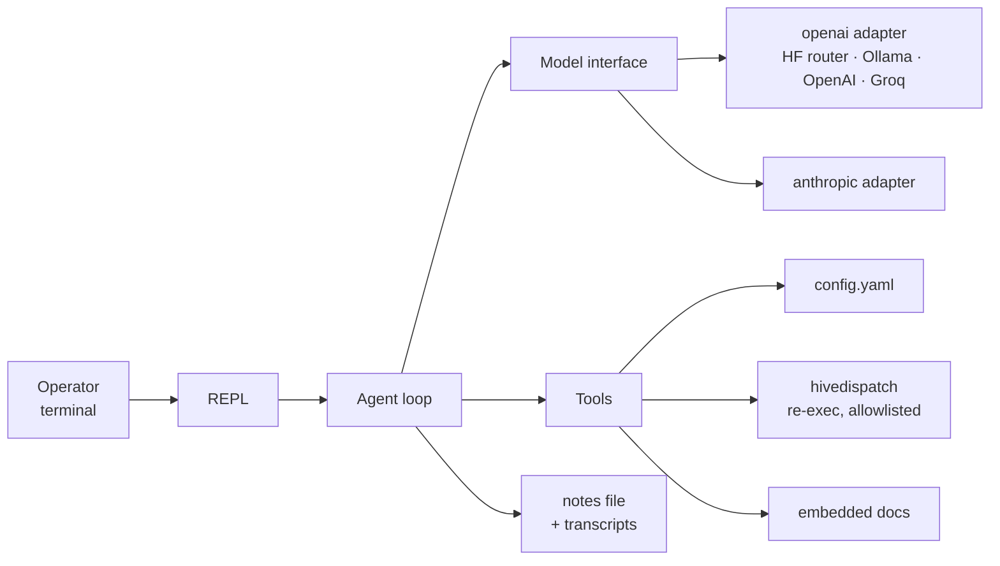

# Supervisor agent — design

2026-09-20 · Amends [design-spec.md](../../design-spec.md) § Supervisor tier. Decisions are recorded in [decisions.md](../../decisions.md).

## Scope

`hivedispatch supervisor` is an interactive agent that helps an operator get HiveDispatch running: it reads the docs, reads and edits the worker config, runs `hivedispatch check` / `init` / `status` / a fake-executor dry run, and remembers what it learned between sessions. It is HiveDispatch's own agent — its own loop, its own tools, its own memory — not a wrapper around Claude Code or Codex. Those are executors; this is the component the original design reserved for fleet-level judgement, started at the one job that is useful today.

**v1 builds:** the `internal/supervisor/model` interface with a fake and two providers (OpenAI-compatible, Anthropic); the `internal/supervisor` loop, six tools, notes-file memory, transcript save/resume, and a line-based terminal REPL; the `supervisor` command; config, docs, and decisions.

**Non-goals for v1**

- Fleet decisions (retry/split/escalate, ordering, overlap). The design spec still says: build those only after the rules-based dispatcher has demonstrably chosen badly, against logged examples.
- Streaming responses, markdown rendering, a raw-mode terminal. Stdlib only.
- Context compaction. A transcript that outgrows the provider's window is reported, not silently truncated.
- Developing HiveDispatch itself (`go test`, editing source). The supervisor operates the tool; it does not hack on it.

## Architecture



Everything the supervisor owns lives under one directory so the work stays segregated from the dispatcher:

- `internal/supervisor/model` — the provider boundary. `Model` interface, then `fake`, `openai`, `anthropic` as sub-packages.
- `internal/supervisor` — the agent: loop, tools, memory, prompt, REPL, and its own config file.
- `docs` — becomes an importable package (`docs/docs.go`, `//go:embed *.md`) so the binary carries its own documentation. This is the one addition outside the folder besides the command.

The command lives in `cmd/hivedispatch/supervisor.go`; `main.go` gains one `case` and one usage line. The worker `config` package, the starter config, the dispatcher and the executors are not modified.

## `internal/supervisor/model`

```go
type Role string // "user" | "assistant" | "tool"

type Message struct {
    Role       Role
    Content    string      // text
    ToolCalls  []ToolCall  // assistant only
    ToolCallID string      // tool results only
    IsError    bool        // tool results only: the tool failed
}

type ToolCall struct {
    ID   string
    Name string
    Args json.RawMessage
}

type ToolDef struct {
    Name        string
    Description string
    Schema      json.RawMessage // JSON Schema for Args
}

type Request struct {
    System    string
    Messages  []Message
    Tools     []ToolDef
    MaxTokens int
}

type Response struct {
    Message    Message // the assistant turn: text and/or tool calls
    StopReason string  // "end_turn" | "tool_use" | "max_tokens"
    Usage      Usage   // InputTokens, OutputTokens
}

type Model interface {
    Name() string // "anthropic/claude-sonnet-5", "ollama/llama3.1"
    Chat(ctx context.Context, req Request) (Response, error)
}
```

The system prompt is a field on the request, not a message, because the two wire formats disagree about where it goes. Tool results are messages with `Role: "tool"` — the adapters translate to `role: tool` (OpenAI) or a `user` message holding `tool_result` blocks (Anthropic).

**Errors.** A non-2xx response is `*model.HTTPError{Status int, Message string}` with the provider's error text extracted from the body when present. 429 and 529 are additionally `*model.RateLimited` (wrapping the HTTPError, carrying `RetryAfter` when the header is set) so the REPL can name the condition. A missing API key is caught at construction (`New` returns an error naming the env var), never at the first call.

### `model/fake`

Scripted: `New(responses ...Response)` returns them in order and records every `Request` in `Calls`. When the script runs out it returns an `end_turn` with empty text, so a runaway loop terminates in tests. Implements `Model`.

### `model/openai`

`POST {BaseURL}/chat/completions`. Tools go as `tools: [{type: "function", function: {name, description, parameters}}]`; assistant tool calls come back in `choices[0].message.tool_calls` and are sent back verbatim on the next request; tool results are `{role: "tool", tool_call_id, content}`. `stop_reason` maps from `finish_reason` (`stop` → `end_turn`, `tool_calls` → `tool_use`, `length` → `max_tokens`).

```go
type Config struct {
    BaseURL string // required; no trailing slash
    Model   string // required
    APIKey  string // empty allowed (Ollama)
    Vendor  string // for Name(): "openai", "huggingface", "ollama"
}
```

Presets live in the supervisor config, not here: this adapter knows one URL shape and nothing about vendors beyond the label.

### `model/anthropic`

`POST https://api.anthropic.com/v1/messages` with headers `x-api-key`, `anthropic-version: 2023-06-01`. `system` is the top-level field; tools are `{name, description, input_schema}`; the response's `content` is a list of `text` and `tool_use` blocks, which fold into one `Message`; tool results go back as a `user` message of `tool_result` blocks, consecutive tool results merged into one message as the API requires. `stop_reason` passes through.

```go
type Config struct {
    Model   string // required
    APIKey  string // required
    BaseURL string // default https://api.anthropic.com; overridable for tests
}
```

## `internal/supervisor`

### Loop

```go
type Agent struct {
    Model      model.Model
    Tools      []Tool
    System     func() string   // rebuilt every turn so the config/check state is fresh
    StepBudget int             // tool calls per user turn; default 20
    Confirm    func(prompt string) bool
    Events     func(Event)     // tool started/finished, budget tripped — the REPL prints these
    history    []model.Message
}

func (a *Agent) Turn(ctx context.Context, user string) (string, error)
```

`Turn` appends the user message, then loops: call the model; if the reply has no tool calls, append it and return its text; otherwise append it, run each tool call in order, append each result, and continue. A tool error becomes a tool result with `IsError: true` and the error text — the model sees it and decides; it does not abort the turn. When the budget trips the loop stops with the last assistant text plus a note, and the history stays consistent (every tool call answered) so the next turn works.

A model error leaves the history exactly as it was before the failing call (the user message stays; the caller may retry or continue). `ctx` cancellation is the same: nothing partial is kept.

### Tools

```go
type Tool interface {
    Def() model.ToolDef
    Call(ctx context.Context, args json.RawMessage) (string, error)
}
```

| Tool | Args | Does | Guardrail |
|---|---|---|---|
| `read_config` | — | returns the config file's text, or `no config at PATH` | path fixed at startup |
| `write_config` | `content` | writes the config to a temp file, runs `config.Load` on it; on failure returns the validation error; on success shows a unified diff and asks `Apply? [y/N]`; on yes copies the old file to `config.yaml.bak` and renames the temp file into place | invalid YAML is never written; a declined write returns "declined by user" to the model |
| `read_doc` | `name` ∈ `setup`, `config`, `design`, `decisions` | returns the embedded markdown from `docs/` | fixed set; `README.md` is summarised in the system prompt instead, and `CONTRIBUTING.md` is for developers, a non-goal |
| `read_repo_file` | `repo`, `name` ∈ `.hivedispatch.yaml`, `AGENTS.md` | reads the file from that repo's base checkout under `workroot` | read-only; those two names only; `repo` must be in `repos[]`; missing checkout says so |
| `run_hivedispatch` | `args` (string array) | re-execs `os.Executable()` with `-config PATH` inserted after the subcommand; returns exit code, stdout, stderr | allowlist below; 5-minute timeout; output capped at 64 KiB (tail kept) |
| `remember` | `note` | appends `- YYYY-MM-DD: note` to the notes file | append-only |

`run_hivedispatch` allowlist, matched exactly after normalisation (flags may appear in any order):

- `version`
- `check`, `check -live`
- `init`, `init -jira`, `init -github`
- `status`, `status -json`
- `run -once -executor fake`, `run -once -executor fake -placeholder`

Anything else is refused with the allowlist in the error text, so the model can correct itself.

**Confirm before mutate.** `write_config` (a diff), `init` (writes the starter config), `init -jira` / `init -github` (write to the tracker) and `run -once …` (may push a branch and open a PR) show what is about to happen and ask `[y/N]` in the terminal. Reads, `check`, `status`, `version` and `remember` run without asking. When stdin is not a terminal the answer is always no.

The diff shown for `write_config` is produced by a small line-based LCS in the package (stdlib has none); it is only for the human and its exact shape is not part of any contract.

### Memory

Everything lives beside the config file: `<dir>/supervisor/memory.md` and `<dir>/supervisor/sessions/<UTC timestamp>.json`.

- **Notes.** Read at startup and included in the system prompt under "Notes from earlier sessions". The prompt copy is capped at 16 KiB, dropping the oldest lines; the file is never truncated. `remember` appends and the next turn's system prompt includes it (the prompt is rebuilt every turn).
- **Transcripts.** The history (`[]model.Message`, no system prompt) is written after every completed turn, atomically. `-resume` loads the newest session file; `-session FILE` a specific one. The system prompt is rebuilt, so a resumed session sees the current config, not the one from last time.

### System prompt

Built fresh each turn, in this order:

1. Role: the HiveDispatch supervisor, helping an operator configure and run HiveDispatch. What HiveDispatch is, in three sentences.
2. Rules: ask before changing anything (the tools enforce this; the prompt explains it); show what you are about to do; cite the doc section you rely on; prefer `read_doc` over guessing a key name; tokens live in environment variables, never in the config; never run the real executor.
3. The tools, briefly, and the `run_hivedispatch` allowlist.
4. Notes from earlier sessions (capped).
5. Current state: config path and whether it exists; the model in use; the output of `hivedispatch check` (not `-live`) captured at the start of the turn. This is what lets the first reply already say what is wrong.

Docs are not inlined. The base prompt stays around 3–4 K tokens; the model pulls a doc when it needs one.

### REPL

```
$ hivedispatch supervisor
supervisor: anthropic/claude-sonnet-5 · config ~/.config/hivedispatch/config.yaml (missing) · notes 0 lines
Type a message; /help for commands, Ctrl-D or /quit to exit.

> I want to run this against GitHub issues on thomasmeadows/HiveDispatch
⋯ read_doc(setup)
⋯ run_hivedispatch(check)
I'll write a starter config for GitHub Issues. Here's the diff:
  --- config.yaml (missing)
  +++ config.yaml
  +agent_id: worker-a
  …
Apply? [y/N] y
✓ wrote ~/.config/hivedispatch/config.yaml
Next, export HIVE_GITHUB_TOKEN (or `gh auth login`) and I'll run `init -github`.
>
```

- `bufio.Scanner` on stdin; no terminal library.
- Each tool call prints one dim line `⋯ name(summary)`; the model's text prints unrendered.
- Slash commands: `/help`, `/quit`, `/notes` (print the memory file), `/model` (provider and model), `/reset` (new session file, history cleared, notes kept).
- Ctrl-C during a turn cancels that turn's context and returns to the prompt; Ctrl-C at an empty prompt exits. Ctrl-D exits.
- Provider errors print on one line, with the remedy when known (`ANTHROPIC_API_KEY is not set`; `rate limited, retry after 30s`; `model "x" not found`), and the prompt returns. The session is never lost to a failed call.
- Non-tty stdin: read all of stdin as one message, print the answer, exit 0 (1 on error). Confirmations answer no.
- A "thinking…" spinner on stderr while a model call is in flight, only when stderr is a terminal (same `isTerminal` as `run`).

## Configuration

The supervisor has its own file, `<config dir>/supervisor/config.yaml` (by default `~/.config/hivedispatch/supervisor/config.yaml`; `-config PATH` for the worker config moves it to `<dir of PATH>/supervisor/config.yaml`), so nothing about the supervisor is in the worker config it helps the operator write:

```yaml
provider: anthropic     # anthropic | openai | huggingface | ollama
model: ""               # default per provider (below)
base_url: ""            # openai/huggingface/ollama: overrides the preset
api_key_env: ""         # default per provider
max_tokens: 4096
step_budget: 20         # tool calls per turn
```

| Provider | Adapter | Default model | Default `base_url` | Default `api_key_env` |
|---|---|---|---|---|
| `anthropic` | anthropic | `claude-sonnet-5` | `https://api.anthropic.com` | `ANTHROPIC_API_KEY` |
| `openai` | openai | `gpt-5-mini` | `https://api.openai.com/v1` | `OPENAI_API_KEY` |
| `huggingface` | openai | `Qwen/Qwen3-32B` | `https://router.huggingface.co/v1` | `HF_TOKEN` |
| `ollama` | openai | `qwen3` | `http://localhost:11434/v1` | *(none)* |
| `fake` | fake | — | — | — |

Default models are best-effort names at the time of writing; the docs say to check the provider's catalogue and set `model` explicitly. `fake` is accepted by `-provider` only (not in the config), for tests — the same convention as `-executor fake`.

**Load.** `supervisor.LoadConfig(path)` returns defaults when the file is missing and an error naming the field for an unknown provider or a non-positive `max_tokens` / `step_budget`. The worker config is never read at supervisor startup except by the tools (and `hivedispatch check`), so the command starts before the worker config exists — that is its job.

**Provider from the environment.** With `provider` empty (and no `-provider` flag): `ANTHROPIC_API_KEY` set → anthropic; else `OPENAI_API_KEY` → openai; else `HF_TOKEN` → huggingface; else ollama. If ollama is chosen by default and `GET {base_url}/models` fails at startup, the command exits with a message listing the three env vars and the Ollama URL it tried.

Flags: `-config` (the worker config path, as for every other command), `-provider`, `-model`, `-resume` (newest session) or `-session FILE` (Go's flag package has no optional values). `docs/config.md` gains a "Supervisor config" section with the keys and the provider table; `docs/setup.md` gains a "Getting help from the supervisor" section near the top; `README.md` gets one line in the quick start. The worker starter config is not touched.

## Decisions to record

Each goes in `docs/decisions.md` with the alternative rejected:

1. **The supervisor is HiveDispatch's own agent loop**, not a wrapper around Claude Code or Codex. Rejected: `claude --append-system-prompt` in interactive mode — less code, but the point is an agent HiveDispatch owns, with memory and tools it controls, that can later make fleet decisions from the state branch.
2. **OpenAI-compatible `chat/completions` is the second provider shape.** One adapter reaches Hugging Face's router, Ollama, OpenAI, Groq, vLLM and LM Studio. Rejected: a per-vendor adapter each — the wire format is shared; only the URL and key differ.
3. **Tool subcommands re-exec the binary.** Rejected: moving `check`/`init` into an internal package — a refactor of `main.go` with no user-visible gain; re-exec shows the operator exactly what they would see, and the allowlist is a list of argv shapes.
4. **Confirm before mutate, in the terminal.** Every tool that changes something outside the supervisor's own notes asks `[y/N]` with the change shown. Rejected: trusting the model's judgement with a rules-in-prompt approach — the guardrail must be code, as with triage (read-only) and the executor (allowlist).
5. **Notes file plus transcripts, no compaction.** Rejected: replaying all past transcripts (context grows without bound) and summarising with the model (an extra call per session whose failure mode is silent loss).
6. **The supervisor is segregated: one directory, its own config file.** Everything under `internal/supervisor`, settings in `supervisor/config.yaml` beside the worker config. Rejected: a `supervisor:` block in the worker config — it would put the assistant's settings in the file it is editing, and spread supervisor code through `config`, `starter` and the docs table.

## Testing

- `model/openai`, `model/anthropic`: `httptest.Server` round trips against fixtures under `testdata/`: text reply; tool-call reply; the follow-up request carrying the tool result (asserting the exact JSON the server received); 401 → `HTTPError` with the provider's message; 429 → `RateLimited`.
- `supervisor` loop with `model/fake`: text-only turn; tool call → result → final text (asserting the history shape); step budget trips and history stays consistent; model error leaves history unchanged; tool error is fed back with `IsError`.
- Tools: `write_config` rejects invalid YAML with the loader's message and leaves the file untouched; a valid write produces the diff, asks, writes `.bak`; a declined write changes nothing; `run_hivedispatch` refuses off-allowlist argv and accepts flag reordering; `read_repo_file` rejects unknown names and unknown repos; `remember` appends dated lines; notes cap drops oldest lines.
- Memory: transcript is written after a turn and `-resume` reloads it; `/reset` starts a new file.
- Config: defaults on a missing file; an unknown provider and a non-positive budget are rejected with the field name; provider-from-environment order; `-provider`/`-model` override the file.
- `cmd/hivedispatch`: `supervisor` is in the usage text; a piped one-shot against `-provider fake` prints the fake's reply and exits 0.
- Live, before the task is declared done: run it against Anthropic and against Ollama (or the Hugging Face router) with the config file absent, and reach a green `check -live` through the supervisor alone.
